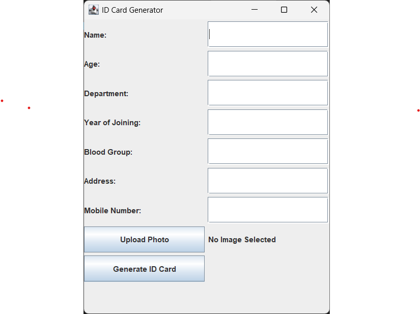
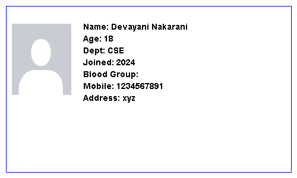

# Java ID Card Generator Project

A desktop application that generates digital ID cards using Java and Swing. It allows users to input personal details and photos, and creates a formatted ID card with export functionality.

## 🖥️ Features

- Collect user details through a GUI form  
- Upload and embed profile pictures  
- Automatically generate a styled ID card preview  
- Save or export the generated ID card as an image  
- Responsive layout using Java Swing

## 📁 Folder Structure

```
IDCardGenerator/
├── .vscode/              # VS Code settings
├── bin/                  # Compiled .class files
├── src/                  # Java source code
│   └── Main.java         # Main Java file with main method
├── screenshots/          # Project screenshots
└── README.md             # Project documentation
```

## 🚀 Getting Started

### ✅ Prerequisites

- Java Development Kit (JDK) installed  
- IDE like VS Code, IntelliJ IDEA, or Eclipse

### 🛠️ How to Run

1. Clone the repository:
   ```bash
   git clone https://github.com/DevayaniNakarani/IDCardGenerator-Project.git
   ```

2. Navigate to the project folder:
   ```bash
   cd IDCardGenerator-Project/IDCardGenerator
   ```

3. Compile:
   ```bash
   javac -d bin src/*.java
   ```

4. Run:
   ```bash
   java -cp bin Main
   ```

## 📸 Screenshots

### 🧍 User Info Input Form


### 🧾 Sample Generated ID Card


## 💻 Technologies Used

- Java  
- Swing (for GUI)  
- ImageIO (for image handling)  
- VS Code (for development)

## 👩‍💻 Author

**Devayani Nakarani**  
🔗 [Portfolio](https://devayani-portfolio.netlify.app)  
🐙 [GitHub](https://github.com/DevayaniNakarani)
